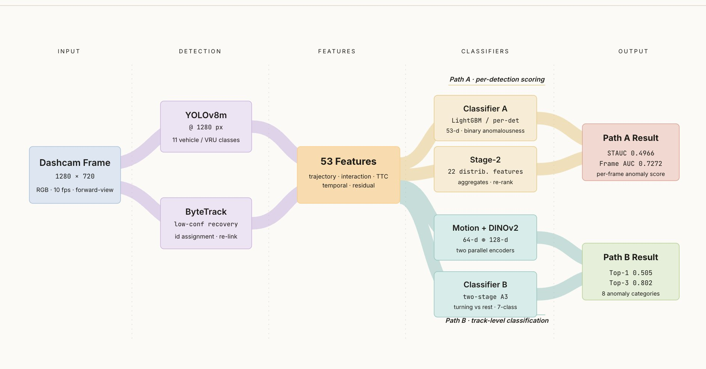
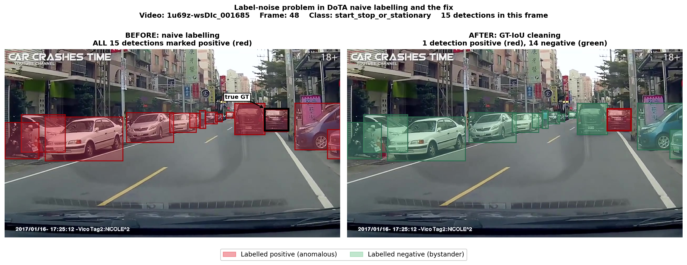
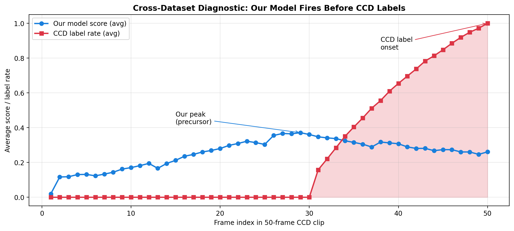

# Object-Level Traffic Anomaly Detection in Dashcam Videos

> **Detects not just *when* a traffic anomaly happens, but *which object* is anomalous — and beats the published baseline at spatio-temporal localisation.**

A two-path pipeline on the full DoTA dataset (4,677 dashcam videos), plus zero-shot cross-dataset evaluation on Nexar and CCD.

**Frame AUC 0.7272 · STAUC 0.4966 (beats Yao et al. FOL-Ensemble's 0.4850) · graded 27 / 30** (ENGG\*6100 Machine Vision, University of Guelph).



---

## Results at a glance

| Metric | Yao et al. baseline | This work |
|---|---|---|
| Frame AUC | 0.7300 | 0.7272 |
| **STAUC** | 0.4850 | **0.4966** |
| AUC − STAUC gap | 0.245 | **0.231** (narrower = better localisation) |

The proposal hypothesis was that object-level supervision would localise anomalies better than frame-level baselines. The narrower AUC−STAUC gap confirms it.

## Two findings that shaped the project

**1. A label-noise discovery worth more than any model change.**



Naive labelling marked *every* detection in an anomaly frame as positive. A GT-IoU ≥ 0.3 filter corrected **692,412 detections** and lifted per-detection AUC from 0.88 → 0.9151 — with no architecture change at all.

**2. The model anticipates crashes before they're labelled.**



Cross-dataset CCD evaluation looked like failure (AUC 0.4483, below chance) — until inspection showed the model peaks 2–4 frames *before* CCD's labelled crash onset. Precursor-window AUC rises monotonically (0.497 → 0.554), confirming anticipation, not failure.

## The pipeline

```
Frame → YOLOv8m @1280 → ByteTrack → 53-d features
   ├─ Path A: LightGBM (per-detection AUC 0.9151) → Stage-2 aggregator (frame AUC 0.7272)
   └─ Path B: motion (64-d) ⊕ DINOv2 visual (128-d) → category (top-1 0.505 / top-3 0.802)
```

## Read more

- **[Full report (PDF)](report/DoTA_Project4_FinalReport.pdf)**
- [Methodology](docs/methodology.md) · [Results](docs/results.md) · [References](docs/references.md)

## A note on code

The training/inference pipeline (YOLOv8 + ByteTrack + LightGBM + DINOv2) was developed on Kaggle and is kept private in line with course academic-integrity policy. The reproducible figure-generation scripts and full report are public here. Happy to walk through the implementation with anyone interested.

## Author

**Antony Gerold Arockiasamy** · MEng Computer Engineering, University of Guelph · ENGG\*6100 Machine Vision.

## License

Documentation and figures: MIT — see [LICENSE](LICENSE). DoTA dataset © Yao et al.
