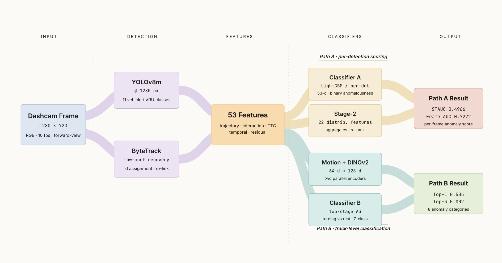
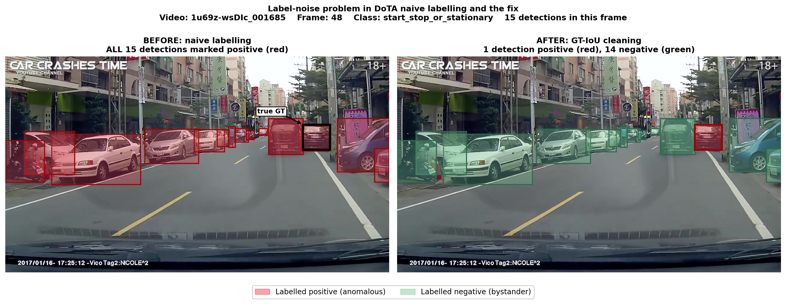
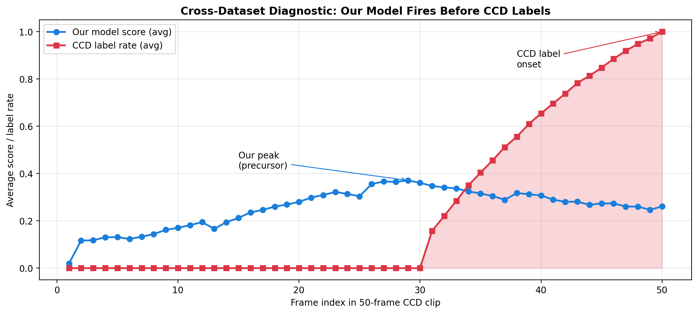

# Object-Level Traffic Anomaly Detection in Dashcam Videos

Detects when a traffic anomaly happens in dashcam footage, which object is anomalous, and what category of anomaly it is. Trained and evaluated on the full DoTA dataset (4,677 videos, 2.74 million per-detection samples), and tested on CCD and Nexar without retraining.

**Frame AUC 0.7272, STAUC 0.4966 vs 0.4850 for Yao et al.'s FOL-Ensemble (+0.012), with a smaller AUC-STAUC gap (0.231 vs 0.245).** ENGG\*6100 Machine Vision, University of Guelph.



*Object-level pipeline. Path A scores each detection and aggregates to a per-frame score; Path B classifies the anomaly category of each anomalous track (Figure 1 of the report).*

---

## Results at a glance

| Metric | Yao et al. FOL-Ensemble | This work | Δ |
|---|---|---|---|
| Frame AUC | 0.7300 | 0.7272 | −0.003 |
| **STAUC** | 0.4850 | **0.4966** | **+0.012** |
| AUC − STAUC gap | 0.245 | **0.231** | −0.014 |

Frame AUC is tied. STAUC, the metric the DoTA paper introduced to reward methods that identify which object is anomalous, is higher, and the smaller gap means the method is localizing the anomalous object rather than flagging the right frames for the wrong reasons. The FOL-Ensemble baseline was not retrained: its numbers come from the original paper on the 1,402-video DoTA validation split, while this work reports pooled 5-fold out-of-fold predictions across all 4,677 videos. Both evaluate on videos not seen during training.

## Two findings that shaped the project

**1. Label noise mattered more than the model.**



*Naive labelling marks every detection in an anomaly frame as positive; GT-IoU cleaning keeps only the true anomalous object positive (Figure 2 of the report).*

Detections in the anomaly window with IoU below 0.3 against the ground-truth anomalous box were relabelled as negative. This corrected **692,412 detections** and lifted Classifier A AUC from **0.88 to 0.9151** without changing the model.

**2. On CCD, the model fires before the crash is labelled.**



*Average per-frame model score (blue) vs average CCD positive-label rate (red) across all 1,500 CCD videos (Figure 10 of the report).*

Zero-shot frame AUC on CCD was 0.4483, below chance. The model's average score peaks around frame 29, while CCD labels begin at frame 30. Treating the N frames before CCD's labelled onset as positive gives AUC rising from **0.497 (N = 3) to 0.554 (N = 15)**, which shows the pipeline is detecting pre-collision precursors that CCD labels as normal. On Nexar, zero-shot frame AUC was 0.6048.

## The pipeline

```
Frame -> YOLOv8m @1280 -> ByteTrack -> 53-d per-detection features
   Path A: LightGBM Classifier A (per-detection AUC 0.9151) -> Stage-2 (frame AUC 0.7272, STAUC 0.4966)
   Path B: motion signature (64-d) + DINOv2 (128-d) -> Classifier B (top-1 0.505, top-3 0.802, 8 categories)
```

## Read more

- **[Full report (PDF)](report/DoTA_Project4_FinalReport.pdf)**
- [Methodology](docs/methodology.md), [Results](docs/results.md), [References](docs/references.md)

## A note on code

The training and inference pipeline was developed on Kaggle and is kept private in line with course academic-integrity policy. Happy to walk through the implementation with anyone interested.

## Author

**Antony Gerold Arockiasamy**, ENGG\*6100 Machine Vision, University of Guelph.

## License

Documentation and figures: MIT, see [LICENSE](LICENSE). DoTA dataset © Yao et al.
